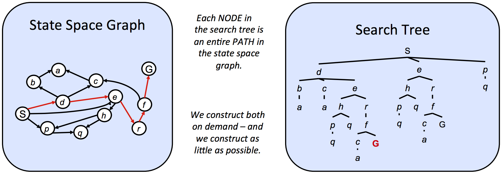

## CS 180 - Introduction to AI

### Lecture 1: Search

#### 1. Different Agents

* **Reflex agents:**  based on current percept (and maybe memory).
* **Planning agents:** based on (hypothesized) consequences of actions.

#### 2. Search Problem 搜索问题

一个搜索问题必须包含以下元素：
* A **state space** - The set of all possible states that are possible in your given world
* A set of **actions** available in each state
* A **transition** model - Outputs the next state when a specific action is taken at current state
* An action **cost** - Incurred when moving from one state to another after applying an action
* A **start state** - The state in which an agent exists initially
* A **goal test** - A function that takes a state as input, and determines whether it is a goal state
  
A solution is a sequence of actions (a plan) which transforms the start state to a goal state.

##### 2.1. State Space

解决问题无需所有细节

* **World State:** includes every last detail of the environment.
* **Search State:** keeps only the details needed for planning.

##### 2.2. State Space Graphs
A mathematical representation of a search problem. 

(We can rarely build this full graph in memory - **Too Big!!!**)

* Nodes - (abstracted) world configurations
* Arcs - successors (actions)
* The goal test is a set of goal nodes (maybe only one)

搜索问题在于寻找从初始状态到目标状态的路径。

所有可能位置和道路构成的完整地图即为状态空间图。

##### 2.3. Search Tree

*General Procedure*
```
function Tree-Search(problem,strategy) -> returns a solution, or failure
    initialize the search tree using the initial state of problem
    loop do
        if no candidates for expansion:
            return failure
        
        choose a leaf node for expansion according to startegy
        if node contains a goal state:
            return the corresponding solution
        else:
            expand the node and add the resulting nodes to the search tree
```



*如果这些结构体过大而无法在内存中表示怎么办？*  
仅储存当前状态！


> **Similarity**  
> 永远无法在内存中构建完整的搜索树，因为它会变得过于庞大

> **Each NODE in the search tree is an entire PATH in the state space graph.**  
> 搜索树中的节点不仅表示一个位置，更代表到达该位置所采取的完整动作序列。


#### 3. Uninformed Search Methods

当我们在搜索树中无法确定目标状态的位置时，就不得不从**无信息搜索**范畴内的技术中选择树搜索策略。  
这包含了三个常见的算法： DFS, BFS, UCS。

##### 3.1. Depth-First Search (DFS)
| 特性 | 描述 |
| :--- | :--- |
| **思路** | 从起始节点选择最深的边界节点进行扩展。 |
| **边界** | 移除最深节点并用其子节点替换。这同时意味着子节点现在成为新的最深节点——它们的深度比之前最深节点的深度大1。**使用 Stack 很容易能完成！** |
| **完整性** | 不完全。如果存在循环，相应的搜索树深度会无限。 |
| **最优性** | 不具备。只是在搜索树中找到“最左边”的解决方案，而不考虑路径成本。 |
| **时间复杂度** | $O(b^m)$, $m$ is the maximum depth, $b$ is the branching factor （一个节点最多有多少个子节点）. |
| **空间复杂度** | $O(bm)$ |

> 例：在一个图中用 DFS 找到从节点 A 到 G 的路径  
```
              (A)
               |
        +------+------+
        |             |
       (B)           (C)
        |             |
     +--+--+          |
     |     |          |
    (D)   (E)        (F)
           |          |
           |          |
           +---+------+
               |
              (G)
```

逻辑：使用两个数据结构实现
* 边界 (Frontier)：用一个栈 (Stack) 来实现。栈顶永远是我们下一步要探索的节点。
* 已访问 (Visited)：用一个集合 (Set) 来记录已经探索过的节点，防止走回头路或陷入死循环。

> **Step 0:** 将起点 A 放入栈中。 
* Frontier (Top -> Bottom): [A]  
* Visited: {}
> **Step1:** 探索 A  
> 从栈顶取出 A。A 不是目标。将 A 标记为“已访问”。找到 A 的所有邻居 (B, C)，将它们压入栈中。
*  Frontier: [B, C]
*  Visited: {A}
>**Step 2:** 探索 B  
>从栈顶取出 B。B 不是目标。将 B 标记为“已访问”。找到 B 的邻居 (D, E)，将它们压入栈中。
* Frontier: [D, E, C]
* Visited: {A, B}
>**Step 3:** 探索 D (撞南墙)
>从栈顶取出 D。D 不是目标。将 D 标记为“已访问”。D 没有任何邻居，是个死胡同。
* Frontier: [E, C]
* Visited: {A, B, D}
>**Step 4:** 探索E
* Frontier：[G, C]
* Visited: {A, B, D, E}
>**Step 5:** 探索G (找到目标！)
>从栈顶取出 G。G 是我们的目标！搜索成功！

##### 3.2. Breadth-First Search (BFS)
| 特性 | 描述 |
| :--- | :--- |
| **思路** | 选择距离起始节点最浅的边界节点进行扩展。 |
| **边界** | 先访问较浅的节点，然后再访问较深的节点，按照节点的插入顺序进行访问。**使用Queue很容易实现！** |
| **完整性** | 完全。层数有限，必然到达最深处。 |
| **最优性** | 不具备。在确定边界上要替换的节点时根本不考虑成本。BFS 保证最优的特殊情况是所有边成本相等，因为这会将 BFS 简化为均匀成本搜索的特例。 |
 **时间复杂度** | $O(b^s)$, $s$ 为最优解的深度, $b$ is the branching factor （一个节点最多有多少个子节点）. |
| **空间复杂度** | $O(b^s)$

##### 3.3. Uniform Cost Search (UCS)
| 特性 | 描述 |
| :--- | :--- |
| **思路** | 始终从起始节点选择成本最低的边界节点进行扩展。 |
| **边界** | 选择基于堆的**Priority Queue**。入队节点$v$的优先级为起点节点到$v$的路径成本，或$v$的后向成本。在移除当前最小成本路径并替换为其子节点时，会自动重新排序以维持基于路径成本的期望排序。 |
| **完整性** | 完全。如果目标状态存在，它必然存在一条有限长度的最短路径. |
| **最优性** | 具备。(统一成本搜索采用的策略与 Dijkstra 算法相同，主要区别在于 UCS 会在找到解状态时终止，而不是找到到达所有状态的最短路径。) |
 **时间复杂度** | $O(b^{C^*/\epsilon})$, $C^*$ 为从起点到终点的最优路径的实际成本, $\epsilon$ 为任意一步（边）的最小成本。 |
| **空间复杂度** | $O(b^{C^*/\epsilon})$

```
           (A) <-- 起点
          /   \
         /     \
      (1)       (5)
       /         \
      v           v
     (B)         (C)
      \           /
       \         /
      (3)       (1)
         \     /
          v   v
           (D)
            |
           (2)
            |
            v
           (G) <-- 目标
```
逻辑：
* 边界 (Frontier)：用一个优先队列 (Priority Queue) 实现。队列中的每个元素是 (成本, 节点)，并始终按成本从小到大排序。
* 已探索 (Explored)：用一个集合 (Set) 来记录已经探索过的节点，确保我们不会重复处理。

>**Step 0:** 初始化  
>将起点 A 放入优先队列，其成本为0。
* Frontier (按成本排序): [(0, A)]  
* Explored: {}

>**Step 1:** 探索 A
>从优先队列中取出成本最低的节点 (0, A)。将 A 放入“已探索”。找到 A 的邻居 B 和 C。
>
>到 B 的成本是 0 + 1 = 1。将 (1, B) 放入队列。  
>到 C 的成本是 0 + 5 = 5。将 (5, C) 放入队列。
* Frontier: [(1, B), (5, C)]
* Explored: {A}

>**Step 2:** 探索 B (而不是 C！)
>此时队列中成本最低的是 (1, B)。取出它，并将 B 放入“已探索”。找到 B 的邻居 D。
>
>到 D 的成本是 (A到B的成本) + (B到D的成本) = 1 + 3 = 4。将 (4, D) 放入队列。
>
* Frontier: [(4, D), (5, C)]  (注意 (4,D) 排在了 (5,C) 的前面)
* Explored: {A, B}
>
>关键点： 尽管 C 是 A 的直接邻居，但因为当前到 D 的已知路径成本(4)比到 C 的成本(5)更低，所以UCS优先选择了这条看起来更有希望的路径。

>**Step 3:** 探索 D
>从优先队列中取出成本最低的节点 (4, D)。将 D 放入“已探索”。找到 D 的邻居 G。
>
>到 G 的成本是 (A到D的成本) + (D到G的成本) = 4 + 2 = 6。将 (6, G) 放入队列。
>
* Frontier: [(5, C), (6, G)]
* Explored: {A, B, D}

>**Step 4:** 探索 C
>从优先队列中取出成本最低的节点 (5, C)。将 C 放入“已探索”。找到 C 的邻居 D。
>
>到 D 的新路径成本是 (A到C的成本) + (C到D的成本) = 5 + 1 = 6。
>
>检查发现 D 已经在“已探索”集合里了。而且新路径成本(6)并不比之前到 D 的成本(4)更低，因此我们忽略这条路径。
>
* Frontier: [(6, G)]
* Explored: {A, B, D, C}

>**Step 5:** 探索 G (找到目标！)
>从优先队列中取出成本最低的节点 (6, G)。
>G 是我们的目标！搜索成功！ 找到的最低成本是 6，路径为 A -> B -> D -> G。

---