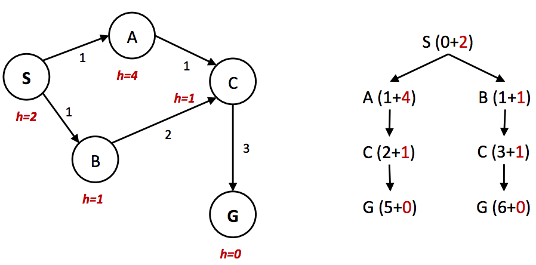

## CS 180 - Introduction to AI

### Lecture 2: Informed Search

**这和Uninformed Search有什么区别？**
利用与问题相关的额外信息，优先探索“看起来”离目标最近的节点。  
不过，实际上未必会更近！

#### 1. Heuristics

A heuristic is a function that estimates how close a state is to a goal.

启发式算法通常是针对宽松问题（即移除了原始问题的一些约束）的解决方案


#### 2. Greedy Search 贪婪搜索

| 特性 | 描述 |
| :--- | :--- |
| **思路** | 选择具有最低启发式值的边界节点进行扩展。 |
| **边界** | 采用**Priority Queue**。区别在于，贪婪搜索不是使用后向成本（从起点走到当前节点 $n$ 所已经花费的实际成本）来分配优先级，而是使用启发式值形式的预估前向成本（从当前节点 n 走到终点所预估的剩余成本）。 |
| **完整性** | 不完全。在不同场景下的表现通常相当难以预测。 |
| **最优性** | 不具备。在不同场景下的表现通常相当难以预测。 |

> **对比UCS和Greedy Search**  
> 从城市 S (起点) 前往城市 G (终点)。途中有两个中转城市 A 和 B。
```
      (cost=5)
   A --------- G
  /           /
(cost=4)   (cost=2)
/           /
S --------- B
  (cost=2)
```
给定 Heuristics （贪婪搜索需要，UCS不需要）

我们用“到终点G的直线距离”作为启发式函数 h(n) 的值。  
$$
h(A) = 1   \\
h(B) = 4  \\
h(S) = 5   \\
h(G) = 0 
$$

| 特性 | **UCS (只关心后向成本)** | **Greedy Search (只关心启发值)** |
|---|---|---|
| **核心关注点** | 路径已花费的实际成本 $g(n)$ | 到达目标的估计成本 $h(n)$ |
| **决策过程** | UCS发现去B的成本比去A的成本更低，选择扩展B；随后发现G是终点，搜索结束。 | 贪婪搜索发现A的启发值远低于B的启发值，选择扩展A；随后发现G是终点，搜索结束。 |
| **找到的路径** | S → B → G | S → A → G |
| **最终路径总成本** | 4 | 9 |
| **路径结果** | 最优路径 | 非最优路径 |


#### 3. A* Search

| 特性 | 描述 |
| :--- | :--- |
| **思路** | 选择具有最低估计总扩展成本的边界节点 |
| **边界** | 采用**Priority Queue**。A*将 UCS 使用的总后向成本与贪婪搜索使用的估计前向成本（Heuristics值）相加，从而有效地得出从起点到目标的估计总成本. |
| **完整性&最优性** | 在给定合适的启发式算法（我们稍后会介绍）的情况下，A* 搜索既完备又最优。 |


#### 4. Admissibility 可接纳行 （寻找好的Heuristics）

Recall：首先重新表述 UCS、贪婪搜索和 A* 中用于确定优先级队列顺序的方法。
$g(n)$ - Total backwards cost computed by UCS.
$h(n)$ - The heuristic value function, or estimated forward cost, used by greedy search.
$f(n)$ - Estimated total cost, used by A* search. $f(n) = g(n) + h(n)$

但不是所有Heuristics都能达到完备和最优。这引出了 Admissibility 可接纳性 的概念：
The condition required for optimality when using A* tree search is known as **admissibility**.

启发式算法估计的值不能高估实际成本。
$$\forall n, 0 \leq h(n) \leq h^*(n)$$

**Theorem:** 如果启发式函数 h 满足可接纳性约束，则对该搜索问题使用带有 h 的 A* 树搜索将产生最优解。

[可以在此处查看证明](https://inst.eecs.berkeley.edu/~cs188/textbook/search/informed.html)

#### 5. Graph Search

Intention: 树搜索的问题：在某些情况下，它可能永远找不到解，在状态空间图中无限循环搜索

**Graph Search**
在使用您选择的搜索方法时，维护一个“已到达”的扩展节点集合。然后，确保每个节点在扩展前尚未包含在集合中，如果不在，则在扩展后将其添加到集合中。带有这种附加优化的树搜索称为图搜索。

Intention: 图搜索依然存在问题，举一个例子如下。


由于节点 A 的启发式值远大于节点 B 的启发式值，因此节点 C 首先沿着第二条次优路径扩展为节点 B 的子节点。然后，它被放入“已到达”集。
因此当 A* 图搜索将其作为 A 的子节点进行访问时，它无法重新扩展它，因此它永远找不到最优解。

$\rightarrow$ 不仅需要检查 A* 是否已经访问过某个节点，还需要检查是否找到了一条更便宜的路径！

#### 6. Dominance 优势度 （比较Heuristics的好坏）
怎样更好？ $\rightarrow$ 更精确地估计从任何给定状态到目标的距离!
如果启发式 $a$ 优于启发式 $b$ ，那么对于状态空间图中的每个节点， $a$ 的估计目标距离都大于 $b$ 的估计目标距离。
$$\forall n: h_a(n) \geq h_b(n)$$

通常的做法是，针对任何给定的搜索问题生成多个可采纳启发式算法，并计算它们输出值的最大值.

---

#### 7. Local Search 本地搜索

与之前的不同：之前我们关心目标状态以及到达它的最佳路径，接下来我们只关心目标状态在哪里。

思路：算法局部地向目标值更高的状态移动，直到达到最大值（最好是全局最大值）

这部分包含以下算法：hill-climbing, simulated annealing, local beam search, and genetic algorithms.

**！！！待补充！！！**

