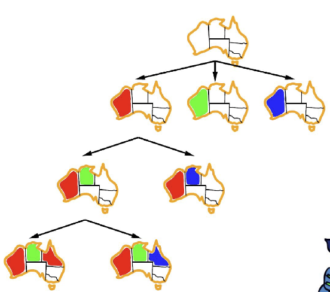
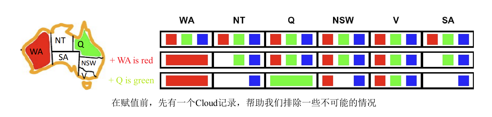
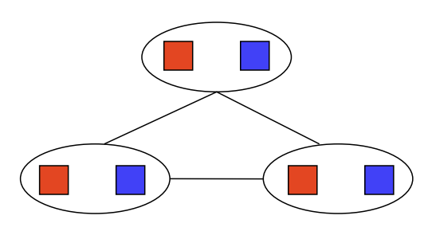

## CS 180 - Introduction to AI

### Lecture 3: Constraint Satisfaction Problems

与搜索问题不同，CSP 是一种识别问题，即我们只需识别某个状态是否为目标状态，而无需考虑如何达到该目标。

约束满足问题是 NP-hard 的，大致意味着不存在已知算法可以在多项式时间内找到此类问题的解。

CSP 由三个因素定义：
* Variables - CSPs possess a set of $N$ variables $X_1, \ldots, X_N$ that can each take on a single value from some defined set of values.

* Domain - A set $\{x_1, \ldots, x_d\}$ representing all possible values that a CSP variable can take on.

* Constraints - Constraints define restrictions on the values of variables, potentially with regard to other variables.

典型的例子是 $N$ 皇后问题。
**变量** - $X_{ij}$，其中 $0 \leq i,j < N$。每个 $X_{ij}$ 代表 $N \times N$ 棋盘上的一个网格位置。

**域** - $\{0, 1\}$。每个 $X_{ij}$ 可以取值 0 或 1，这是一个布尔值，表示在棋盘位置 $(i, j)$ 是否存在一个皇后。

**约束** -
* $\forall i, j, k \ (X_{ij}, X_{ik}) \in \{(0,0), (0,1), (1,0)\}$。任何两个皇后不能在同一行。
* $\forall i, j, k \ (X_{ij}, X_{kj}) \in \{(0,0), (0,1), (1,0)\}$。任何两个皇后不能在同一列。
* $\forall i, j, k \ (X_{ij}, X_{i+k, j+k}) \in \{(0,0), (0,1), (1,0)\}$。任何两个皇后不能在同一主对角线或副对角线上。
* $\forall i, j, k \ (X_{ij}, X_{i+k, j-k}) \in \{(0,0), (0,1), (1,0)\}$。同上。
* $\sum_{i,j} X_{ij} = N$。满足棋盘上恰好有 $N$ 个皇后的要求。


---

#### 1. Constraints Graph 约束图

约束满足问题通常表示为约束图，其中节点表示变量，边表示变量之间的约束。

约束包含以下几种类型：
- Unary Constraints 一元约束：涉及 CSP 中的单个变量。不会在约束图中表示，而是在必要时用于修剪其约束变量的域。
- Binary Constraints 二元约束：二元约束涉及两个变量。它们在约束图中以传统的图边形式表示。
- Higher-order Constraints 高阶约束：涉及三个或更多变量的约束也可以用 CSP 图中的边表示，它们只是看起来有点不寻常。

#### 2. Backtracking Algorithm (Solving CSP)

使用回溯搜索解决——本质上是优化后的 DFS。改进基于以下原则：
- 固定变量的顺序，并按此顺序选择变量的值。（因为赋值是可交换的，所以有效）
- 为变量选择值时，仅选择与之前赋值不冲突的值。如果不存在这样的值，则回溯并返回到上一个变量，并更改其值。

```
function BACKTRACKING-SEARCH(csp) returns solution/failure
  return RECURSIVE-BACKTRACKING({}, csp)

function RECURSIVE-BACKTRACKING(assignment, csp) returns soln/failure
  if assignment is complete then return assignment
  var $\leftarrow$ SELECT-UNASSIGNED-VARIABLE(VARIABLES[csp], assignment, csp)
  for each value in ORDER-DOMAIN-VALUES(var, assignment, csp) do
    if value is consistent with assignment given CONSTRAINTS[csp] then
      add {var = value} to assignment
      result $\leftarrow$ RECURSIVE-BACKTRACKING(assignment, csp)
      if result $\neq$ failure then return result
      remove {var = value} from assignment
  return failure
```



#### 3. Improving Backtracking

##### 3.1. Filitering 过滤

Filtering 解决了 `Can we detect inevitable failure early?` 的问题

**Forward Checking**

检查`未分配变量`与`当前分配变量`的直接冲突！（但其他冲突他就无能为力了）



**Arc Consistency**

* Important: If X loses a value, neighbors of X need to be rechecked!
* Arc consistency detects failure earlier than forward checking
* Can be run as a preprocessor or after each assignment
* What's the downside of enforcing arc consistency?
* Remember: **Delete from the tail!**

```
function AC-3(csp) returns the CSP, possibly with reduced domains
  inputs: csp, a binary CSP with variables {X_1, X_2, ..., X_n}
  local variables: queue, a queue of arcs, initially all the arcs in csp

  while queue is not empty do
    (X_i, X_j) <- REMOVE-FIRST(queue)
    if REMOVE-INCONSISTENT-VALUES(X_i, X_j) then
      for each X_k in NEIGHBORS[X_i] do
        add (X_k, X_i) to queue

function REMOVE-INCONSISTENT-VALUES(X_i, X_j) returns true iff succeeds
  removed <- false
  for each x in DOMAIN[X_i] do
    if no value y in DOMAIN[X_j] allows (x, y) to satisfy the constraint X_i <-> X_j
    then delete x from DOMAIN[X_i]; removed <- true
  return removed
```
Runtime: $O(n^2d^3)$, can be reduced to $O(n^2d^2)$
BUT detecting all possible futrue problems is NP-hard.

**Limitation of Arc Consistancy**
See an example below:

**Arc Consistancy satisfied!! BUT no solution!!!**

##### 3.2. Ordering 排序
在求解 CSP 时，我们会对所涉及的变量和值进行一些排序。
在实践中，使用两个广泛的原则“动态”计算下一个变量及其对应的值通常更有效，这两个原则是：最小剩余值和最小约束值：
- **Minimum Remaining Value 最小剩余值 (MRV)**
  选择未赋值且剩余有效值最少的变量（即约束最严格的变量）。

- **Least Constraining Value 最小约束值 (LCV)**
  选择那个对其他（邻居）变量约束最少的值，即选择一个能为未来的选择保留最多可能性的值。
  这需要额外的计算（例如，对每个值重新运行弧一致性/前向检查或其他过滤方法以找到 LCV），但仍然可以根据使用情况提高速度。

这很有意思！对于variable我们选择做最严格的，但对于value我们选择最宽松的。