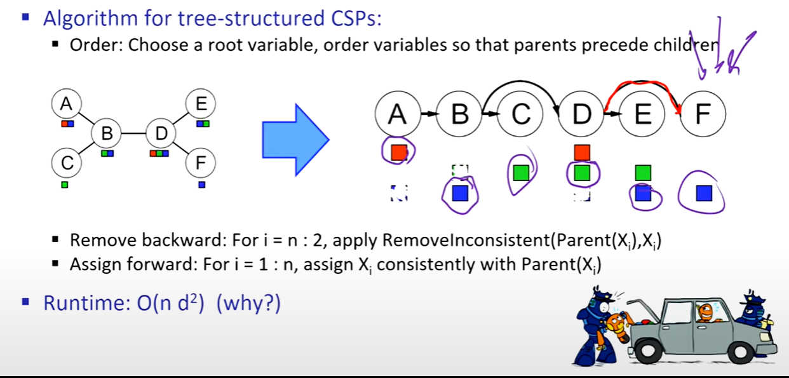
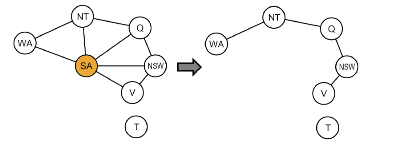
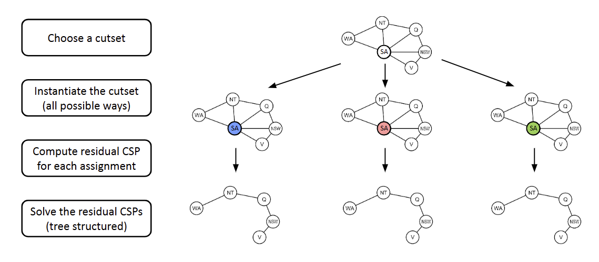

## CS 180 - Introduction to AI

### Lecture 4: Constraint Satisfaction Problems II

#### Recall

**1. K-Consistency**

Increasing degrees of consistency

* **1-Consistency (Node Consistency)**: Each single node's domain has a value which meets that node's unary constraints.

* **2-Consistency (Arc Consistency)**: For each pair of nodes, any consistent assignment to one can be extended to the other.

* **K-Consistency**: For each $k$ nodes, any consistent assignment to $k-1$ can be extended to the $k^{th}$ node.

Higher $k$ more expensive to compute (but makes filtering better: tradeoff!).

**2. Strong K-Consistency**
* **Strong k-consistency的区别**: also k-1, k-2, ... 1 consistent.

* **Claim**: strong n-consistency means we can solve without backtracking!
Problem: NP-hard Problem, so it's extremely hard to build a Strong K-Consistency!!!

* Lots of middle ground between arc consistency and n-consistency! (e.g. k=3, called path consistency)

### 1. Structure: Improvement to solving CSP (continue)
**Theorem**: if the constraint graph has no loops, the CSP can be solved in $O(n \cdot d^2)$ time.
对于一般的CSP问题 worst-case time is $O(d^n)$.

**Tree Structured CSPs**

步骤：
    1. 首先，在约束图中为 CSP 选择一个任意节点作为树的根（哪一个并不重要，因为基本图论告诉我们树的任何节点都可以作为根）。
    2. 将树中所有无向边转换为指向远离根节点的有向边。然后对生成的有向无环图进行排序，使所有边都指向右方。
    3. 执行弧一致性的**反向**传递：从 $i = n$ 向下迭代到 $i = 2$ ，对所有弧 $Parent(X_i) \to X_i$ 强制执行弧一致性。
    4. 最后，执行**前向**赋值。从 $X_1$ 开始，到 $X_n$ ，为每个 $X_i$ 赋值，使其与其父节点的值一致。

由于我们在所有这些弧上都强制了弧一致性，因此无论我们为任何节点选择什么值，我们都知道其子节点至少会有一个一致的值。

#### 2. Improving Structure

Tree is not that common! -> Nearly Tree-Structured CSPs

* **Conditioning (条件化)**: 实例化一个变量，修剪其邻居的域。

* **Cutset Conditioning (割集条件化)**: 实例化（通过所有方式）一组变量，使得剩余的约束图成为一棵树。
* **割集大小 c 的运行时复杂度**为 $O((d^c)(n-c)d^2)$，当 $c$ 很小时，运行速度非常快。
* 

---

#### 3. Local Search 局部搜索

Backtrcking search is not the only algorithm that exists for solving CSP.

Another widely used algorithm is **Local Search**.

局部搜索通过迭代改进来工作——首先对值进行随机赋值，然后迭代地选择一个随机冲突变量，并将其值重新赋给违反约束最少的变量，直到不再存在约束违反。(min-conflicts heuristic)

Local Search 不完整也不最优。

Critical ratio 临界比率：这个比率附近，成本会极其昂贵。
$$
R = \frac{\text{number of constraints}}{\text{number of cariables}}
$$

三种算法（供了解）：hill-climbing, simulated annealing, and genetic algorithms