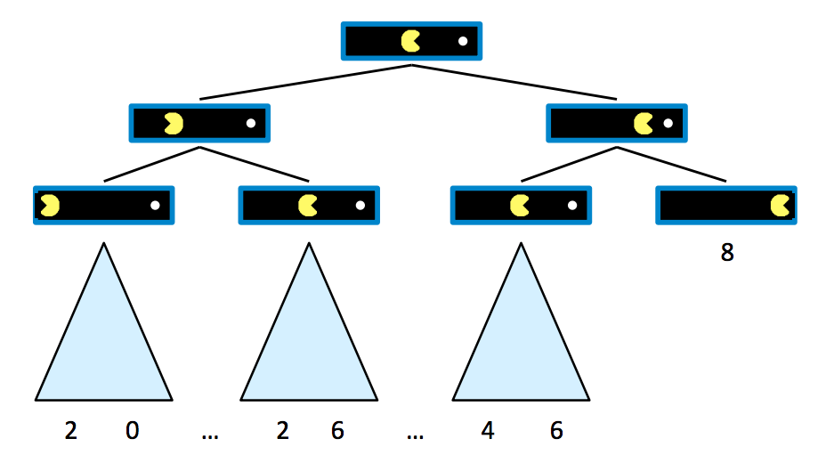
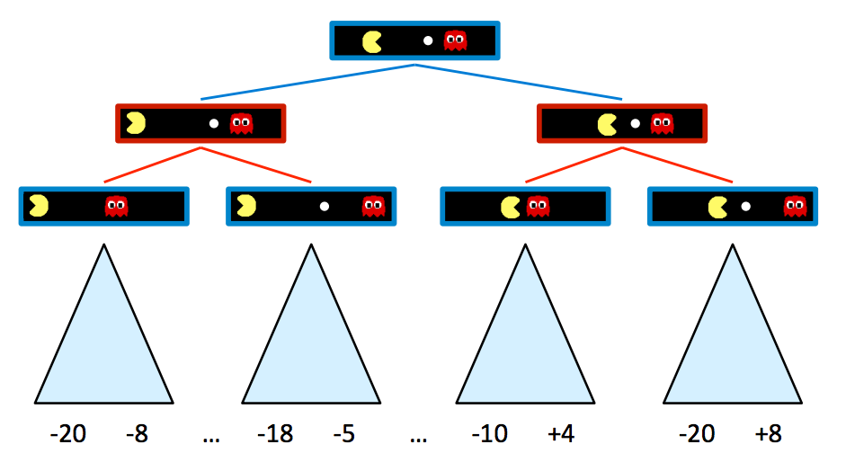
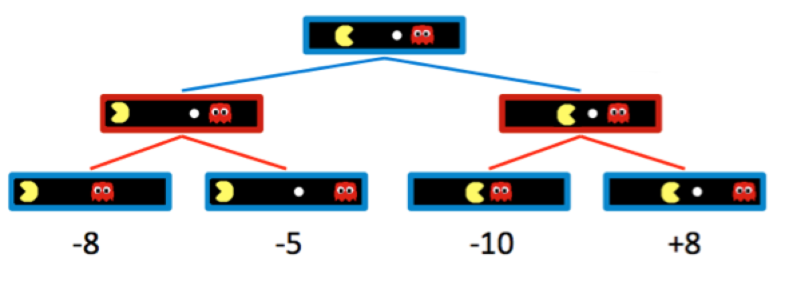
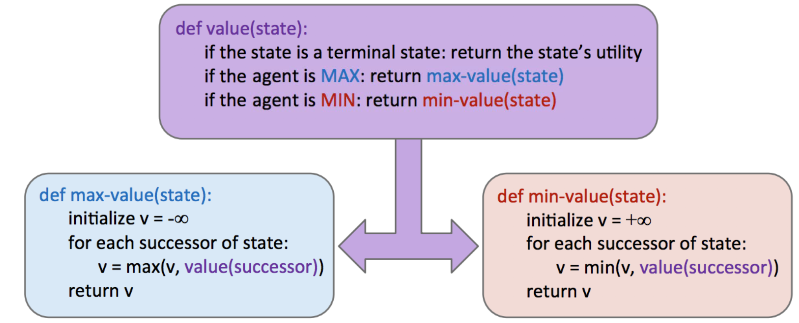

## CS 180 - Introduction to AI

### Lecture 5: Game Tree / Adversarial Search

#### 1. Deterministic Games

Many possible formalizations, one is:

* **Initial state**: `s_0`
* **Players**: `Players(s)` denote whose turn it is
* **Actions**: `Actions(s)` available actions for the player
* **Transition model**: `Result(s, a)`
* **Terminal test (True/False)**: `Terminal-test(s)`
* **Terminal values**: `Utility(s, player)`

#### 2. Settings for Zero-Sum Game
假设吃豆人初始得分为 10 分，每走一步扣 1 分，直到吃掉小球为止。此时游戏到达终止状态并结束。

状态值定义为代理在该状态下能够实现的最佳结果（Utility）,非终端状态的值定义为其子状态值的最大值。

拓展到两个agent：

#### 3. Minimax

基于一个激励假设：我们面对的对手会采取最优行为，并且总是会做出对我们最不利的举动。
分析一个简单的例子：

$\forall$agent-controlled states, $V(s) = \max_{s' \in successors(s)} V(s')$

$\forall$opponent-controlled states, $V(s) = \min_{s' \in successors(s)} V(s')$

