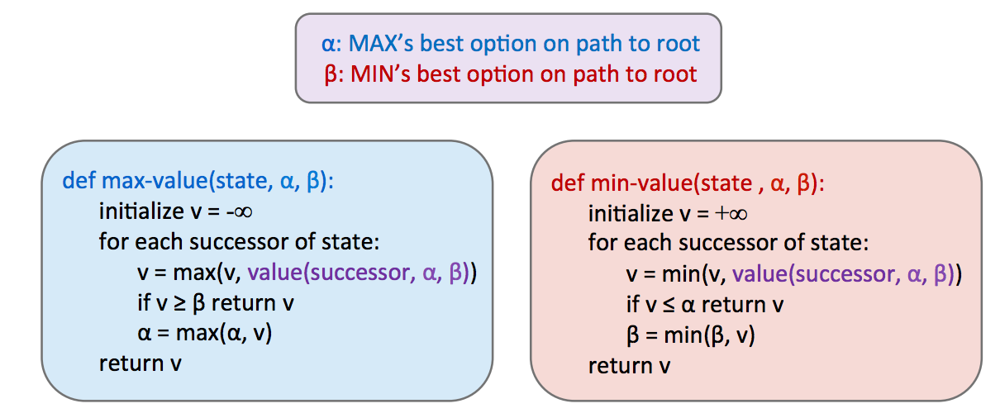

## CS 180 - Introduction to AI

### Lecture 6: Game Tree II

#### 1. Minimax Improving
##### 1.1 Alpha-Beta Pruning

**Intuion**: Minimax看着不错，但他与DFS很类似——时间复杂度$O(b^m)$——运行时间太长！

优化方法：$\alpha-\beta$ pruning。

**只要我们访问了中间最小值值为 2 的子节点，就不再需要查看中间最小值的其他子节点了！**
为什么呢？因为我们已经看到中间最小值的一个子节点的值为 2，所以我们知道，无论其他子节点的值是什么，中间最小值的值最多为 2。
既然这一点已经确定，让我们再进一步思考——根节点的最大值节点正在左边最小值的值 3 和 ≤ 2 之间做出选择，它肯定会优先选择左边最小值返回的 3，而不是中间最小值返回的值，而不管其剩余子节点的值是什么。

Alpha ($α$): MAX 玩家的“最低承诺”（在已探索过的路径中，MAX 玩家至少能获得的分数。）
Beta ($β$): MIN 玩家的“最高限制”

$$\text{if } α ≥ β \rightarrow pruning$$

##### 1.2. Evaluation Function

depth-limited minimax：设置深度限制
$\rightarrow$ 最后一层的状态值怎么得到？
**Heuristics！** 
In this case we call it **evaluation function!**

$Eval(s) = w_1 f_1(s) + w_2 f_2(s) + \dots + w_n f_n(s)$

#### 2. Expectimax
由于极小极大算法认为它正在对最优对手做出响应，因此在无法保证对智能体动作做出最优响应的情况下，它往往会过于悲观。

这种随机性可以通过极小极大值（minimax）的泛化（expectimax）来表示。expectimax 将机会节点引入博弈树，它不像最小化器节点那样考虑最坏情况，而是考虑平均情况。

节点值规则如下：
$$\forall\text{agent-controlled states, } V(s) = \max_{s' \in successors(s)} V(s')$$

$$\forall\text{chance states, } V(s) = \sum_{s' \in successors(s)} p(s'|s)V(s')$$

$$\forall\text{terminal states, } V(s) = \text{known}$$

在上面的公式中，$p(s'|s)$指的是给定的不确定性动作导致从状态 $s$ 移动到 $s'$ 的概率，或者是对于选择导致从状态 $s$ 移动到 $s'$ 的动作的概率，具体取决于游戏的具体情况和所考虑的游戏树。

从这个定义中，我们可以看出 **minimax** 只是 **expectimax** 的一个特例。

#### 3. Other Game
不同的智能体在博弈中可能承担着不同的任务，而这些任务并不直接涉及彼此之间的严格竞争。

这类博弈可以用以多智能体效用为特征的树来构建——表示为元组，元组中的不同值对应于不同智能体的独特效用。然后，每个智能体尝试在其控制的每个节点上最大化自身的效用。
