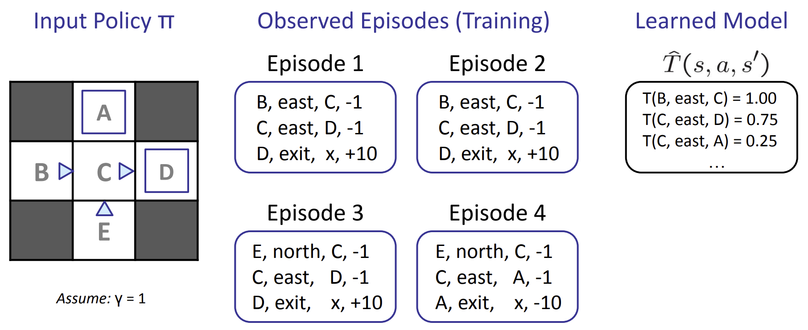

## CS 180 - Introduction to AI

### Lecture 9&10: Reinforcement Learning

上一节课：马尔可夫决策过程，以及用诸如 Value Iteration 和 Policy Iteration 等技术来求解该过程，以计算状态的最优值并提取最优策略。

求解马尔可夫决策过程是 **离线规划 (offline planning)** 的一个例子，其中 Agent 对转换函数和奖励函数拥有充分的了解，它们预先计算最优动作所需的所有信息，而无需实际采取任何行动。

**Next: 在线规划**
在在线规划过程中，代理对现实世界中的奖励或转换没有任何先验知识（仍然以马尔可夫决策过程 (MDP) 的形式表示）。在在线规划中，代理必须尝试探索，在此期间它会执行操作并接收反馈，反馈的形式包括它到达的后继状态及其获得的相应奖励。代理会利用这些反馈，通过一个 RL 来估计最优策略，然后再利用这个估计的策略进行开发或奖励最大化。

**Setup**
- 仍然假设是一个马尔可夫决策过程 (MDP)：
    - 一个状态集合 \(s \in \mathcal{S}\)
    - 一个行动集合（每个状态）\(\mathcal{A}\)
    - 一个模型 \(T(s, a, s')\)
    - 一个奖励函数 \(R(s, a, s')\)
- 仍然在寻找一个策略 \(\pi(s)\)

- 不知道 \(T\) 或 \(R\)

#### 1. Model-Based Learning 

根据大数定律，随着我们通过让代理经历更多场景收集到越来越多的样本，我们的 $\hat{T}$ 和 $\hat{R}$ 模型将会不断改进，其中 $\hat{T}$ 会收敛到 $T$，而 $\hat{R}$ 则会随着我们发现新的 $(s, a, s')$ 组而获取之前未发现的奖励知识。
在合适的时候可以结束代理的训练，通过使用当前的 $\hat{T}$ 和 $\hat{R}$ 模型运行价值或策略迭代来生成策略 $\pi_{exploit}$，并使用 $\pi_{exploit}$ 进行利用，让代理遍历 MDP，采取行动寻求奖励最大化。

#### 2. Model-Free Learning 

**Big Picture**
* Passive reinforcement learning: Direct evaluation and temporal difference learning
  * 在被动强化学习中，智能体被赋予一个策略，并在经历事件的过程中学习该策略下状态的值，这正是当 $T$ 和 $R$ 已知时，MDP 的策略评估所做的事情。
* Active reinforcement learning: Q-learning
  * 在此过程中，学习智能体可以使用收到的反馈在学习过程中迭代更新其策略，直到经过充分探索后最终确定最优策略。

**Regret:** `一开始就在环境中采取最优行动所积累的总奖励`与`通过运行学习算法所积累的总奖励`之间的差异

##### 2.1. Direct Evaluation (Passive RL)

计算得到 $V^\pi(E) = -2$ 和 $V^\pi(B) = 8$，但理论上 $B$ 和 $E$ 在 $\pi$ 下应该具有相同的值。

这是因为我们的代理处于状态 $C$ 的 4 次中，它转换到 $D$ 并获得了 3 次 10 的奖励，转换到 $A$ 并获得了 1 次 $-10$ 的奖励。纯属偶然的是，当它唯一一次获得 $-10$ 奖励时，它的初始状态是 $E$ ，这严重扭曲了 $E$ 的估值。

经过足够多的回合后，$B$ 和 $E$ 的值将收敛到真实值，但这种情况会导致该过程耗时超过我们的预期。可以通过选择使用我们的第二种被动强化学习算法——时间差分学习来缓解这个问题。

##### 2.2. Temporal Difference Learning (Passive RL)
TD Learning 采用从每一次经验中学习的理念，而不是像 Direct Evaluation 那样简单地跟踪总奖励和状态访问次数，并在最后进行学习。

Sample of V(s):
$$
\text{sample} = R(s, \pi(s), s') + \gamma V^\pi(s')
$$

Update to V(s):
$$
V^\pi(s) \leftarrow (1 - \alpha)V^\pi(s) + (\alpha)\text{sample}
$$

其中 learning rate $\alpha \in [0,1]$，一般从 1 慢慢缩小到 0.

##### 2.3. Q-Learning (Active RL)

TD Learning 或 Direct Learning 通常与一些基于模型的学习结合使用，以获取 $T$ 和 $R$ 的估计值，从而有效地更新学习代理所遵循的策略。Q Learning 提出直接学习状态的 $Q$ 值，无需了解任何值、转换函数或奖励函数。因此，$Q$ 学习完全无需模型（off-policy learning）。

$Q$ 学习使用以下更新规则来执行所谓的 $Q$ 值迭代：

$$
Q_{k+1}(s, a) \leftarrow \sum_{s'} T(s, a, s')[R(s, a, s') + \gamma \max_{a'} Q_k(s', a')]
$$
- Learn $Q(s, a)$ values as you go
    - Receive a sample $(s, a, s', r)$
    - Consider your old estimate: $Q(s, a)$
    - Consider your new sample estimate:
    $$
    \text{sample} = R(s, a, s') + \gamma \max_{a'} Q(s', a')
    $$
    - Incorporate the new estimate into a running average:
    $$
    Q(s, a) \leftarrow (1 - \alpha)Q(s, a) + (\alpha) [\text{sample}]
    $$

##### 2.4. Approximate Q-Learning

Q-Learning 占用内存太大，我们可以用特征向量简化：
$$
V(s) = w_1f_1(s) + w_2f_2(s) + \dots + w_nf_n(s)
$$

$$
Q(s, a) = w_1f_1(s, a) + w_2f_2(s, a) + \dots + w_nf_n(s, a)
$$
$$
\text{difference} = \left[r + \gamma \max_{a'} Q(s', a')\right] - Q(s, a)
$$

$$
Q(s, a) \leftarrow Q(s, a) + \alpha [\text{difference}]
$$

$$
w_i \leftarrow w_i + \alpha [\text{difference}] f_i(s, a)
$$

#### 3. Exploration vs. Exploitation / 探索 vs. 利用
* Exploration - 通过尝试不同的行为来得到一个最佳的策略，得到最大奖励的策略。
* Exploitation - 不去尝试新的东西，就采取已知的可以得到很大奖励的行为。

##### 3.1. $\epsilon$ Greedy

遵循 $\epsilon$ Greedy 的代理定义了某个概率 $0 \le \epsilon \le 1$，并且会以概率 $\epsilon$ 随机行动和探索。

如果为 $\epsilon$ 选择了一个较大的值，那么即使在学习了最优策略之后，代理仍然会以随机的方式行事。同样，为 $\epsilon$ 选择了一个较小的值意味着代理将很少进行探索，从而导致 $Q$ 学习（或任何其他选定的学习算法）非常缓慢地学习最优策略。

为了解决这个问题，必须手动调整 $\epsilon$ 并随着时间的推移降低才能看到结果。

##### 3.2. Exploration Function

$$
Q(s, a) \leftarrow (1 - \alpha)Q(s, a) + \alpha \cdot [R(s, a, s') + \gamma \max_{a'} f(s', a')]
$$

其中 $f$ 表示探索函数。设计探索函数有一定的灵活性，但通常的选择是使用：

$$
f(s, a) = Q(s, a) + \frac{k}{N(s, a)}
$$

#### 